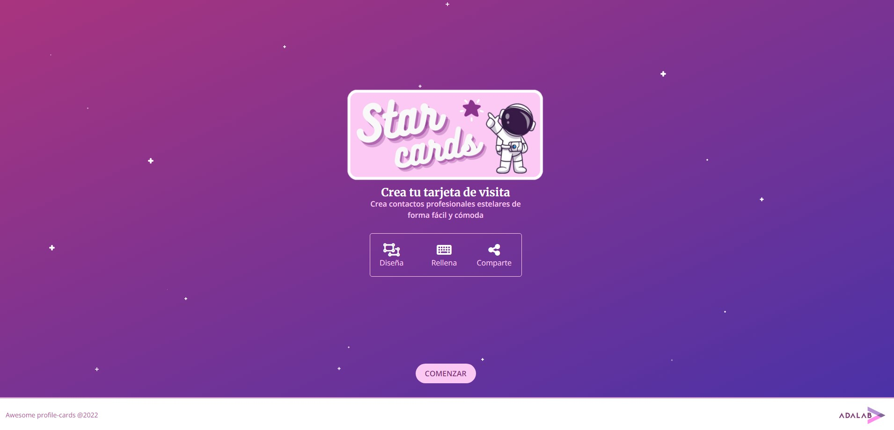
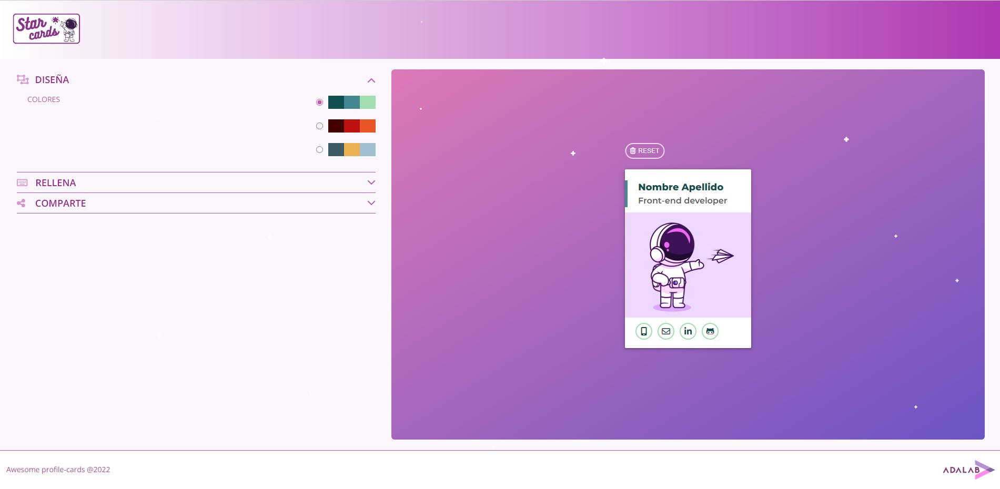
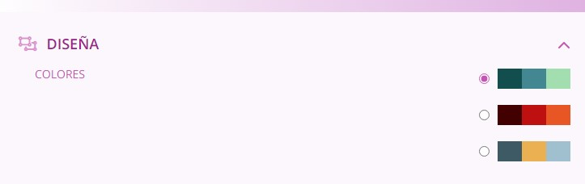
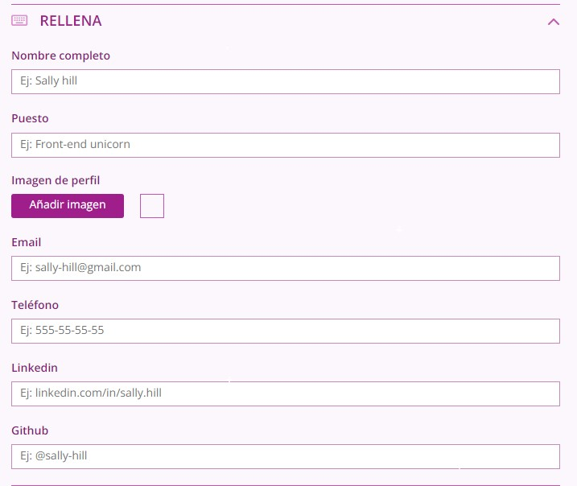

# Star Cards

Hello travellers! Welcome to **Star Cards**, the only website where you will be able to create your own professional and presentation cards at the speed of light.

Mocked up with HTML and Sass and developed with JavaScript, Star Cards is a fully operative and responsive website focused on making your life easier when creating your own professional cards.

Clicking on the GitHub Pages link attached above in the description you will travel directly to our landing. Here you will find the logo of our enterprise and a summary of all the things you will be able to do when entering our site.

Once you have landed, by pressing on the **Comenzar** button at the bottom of the page, you will be redirected to the control room where you will be able to design your own card following these steps:

1. **Choose a set of colors for your card**

2. **Fill the form with the personal information and media links your professional card will share**

3. **Create your card link and Share it with your friends using the link or through Twitter**

Thank you so much for visiting our ship and we hope you enjoyed our project as much as we did developing it.

**Project mocked up and developed by Paula Masutier, Mónica Hidalgo, Rebeca Gómez, Sara Rivera and Yara Paz.**

### Authors:
- [@yarapaz](https://github.com/yarapaz)
- [@pmasutie](https://github.com/pmasutie)
- [@mhidalgoma](https://github.com/mhidalgoma)
- [@SaraRivAl](https://github.com/SaraRivAl)
- [@Becky-Gomez-Castillejos](https://github.com/Becky-Gomez-Castillejos)
